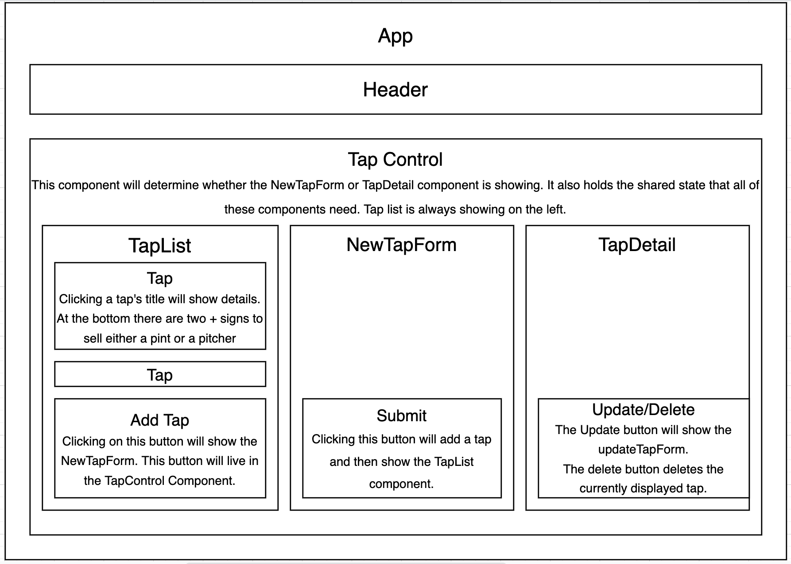

# _Tap Room_

#### _React week 2 React Fundamentals Code Review Project for Epicodus Bootcamp_

#### Created By: **Christopher Neal**

## Technologies Used

- _HTML_
- _CSS_
- _Javascript_
- _React_
- _npm_
- _PropTypes_
- _UUID_
- _Babel_

## Description

_This project was created for Epicodus bootcamp to show proficiency in React Fundamentals. The application is for a tap room store to list their available kegs on tap with descriptions, prices, and remaining pints. The user has full CRUD functionality on the products._

## Project Layout Diagram

## Setup/Installation Requirements

- _React version 3.2.0_

### Basic Setup

- Clone the GitHub repository: [https://github.com/christophermneal/tap-room](https://github.com/christophermneal/tap-room)
- From the main project directory, run `npm install` in the terminal to load necessary plugins and packages.
- Run `npm install --save-exact react-scripts@3.2.0` to install React version 3.2.0
- Run `npm run start` to start the application.

## Known Bugs

_None at this time_

## License

_[MIT](https://opensource.org/licenses/MIT)_
Copyright (c) _2022_ _Christopher Neal_

## Support and Contact Details

- _[christopher.m.neal@gmail.com](mailto:christopher.m.neal@gmail.com)_
